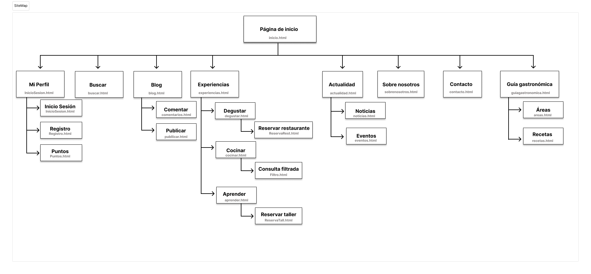

## DIU - Practica2, entregables

### Ideación

### PROPUESTA DE VALOR

Nuestra página web propone una versión combinada de las tradicionales webs sobre gastronomía, ofreciendo no solo información sobre restaurantes y la posibilidad de reservar mesa en ellos, sino también talleres para aprender sobre cocina. Además de ofrecer recomendaciones de restaurantes, la reserva se puede realizar de forma rápida, sencilla e intuitiva desde la propia web. Junto con estas opciones, los usuarios podrán consultar nuestro blog, donde como novedad, los usuarios registrados tendrán la posibilidad de publicar sus propias recetas. Además de estas recetas de usuarios, la web ofrecerá una sección adicional con recetas proporcionadas por profesionales. Como característica destacada, la web ofrecerá un sistema de gestión de puntos canjeables en nuestros servicios. Los puntos se obtendrán por reservas, comentarios, publicaciones e incluso por el tiempo de consulta de algunas secciones como el blog. Como novedad, también pretendemos incluir el contacto a través de redes sociales, además de los típicos métodos de contacto.

### TASK ANALYSIS
* Task Analysis:
[Documento Task Analysis](TaskAnalysis.pdf)
* Tareas: Iniciar sesión, buscar y reservar restaurante.

### ARQUITECTURA DE INFORMACIÓN

* Sitemap

* Labelling:
[Documento Labelling](Labeling.pdf)

### Prototipo Lo-FI Wireframe 
* Bocetos:
[Bocetos](https://github.com/carmenqr/DIU/tree/master/P2/Bocetos)

### Conclusiones  
En esta etapa hemos podido profundizar en el diseño y funcionalidades de la web, así como entender cuál es el punto fuerte de nuestra página y el motivo por el que destaca con respecto a las otras en el mercado. 
Con los diferentes pasos seguidos hemos organizado los puntos claves del diseño en los que hacer incapié y hemos generado unos primeros bocetos y vista de los puntos o acciones clave de la web. 
