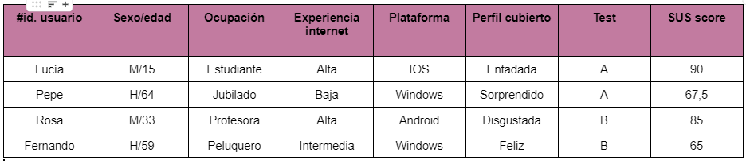

# DIU - Practica 4, entregables

* Users

Elección y características

* A/B Testing.
  

* Tareas realizadas
  
Hemos hecho uso del EyeTracking para evaluar ambas páginas junto con sus zonas de interés. Los resultados pueden consultarse [aquí](EyeTracking/). 

* Usability Report de Caso B
  
Tras analizar completamente la usabilidad del caso asignado, hemos obtenido y redactado el [informe de usabilidad](Informe_usabilidad-SaborArtesanal.pdf)

* Conclusiones
