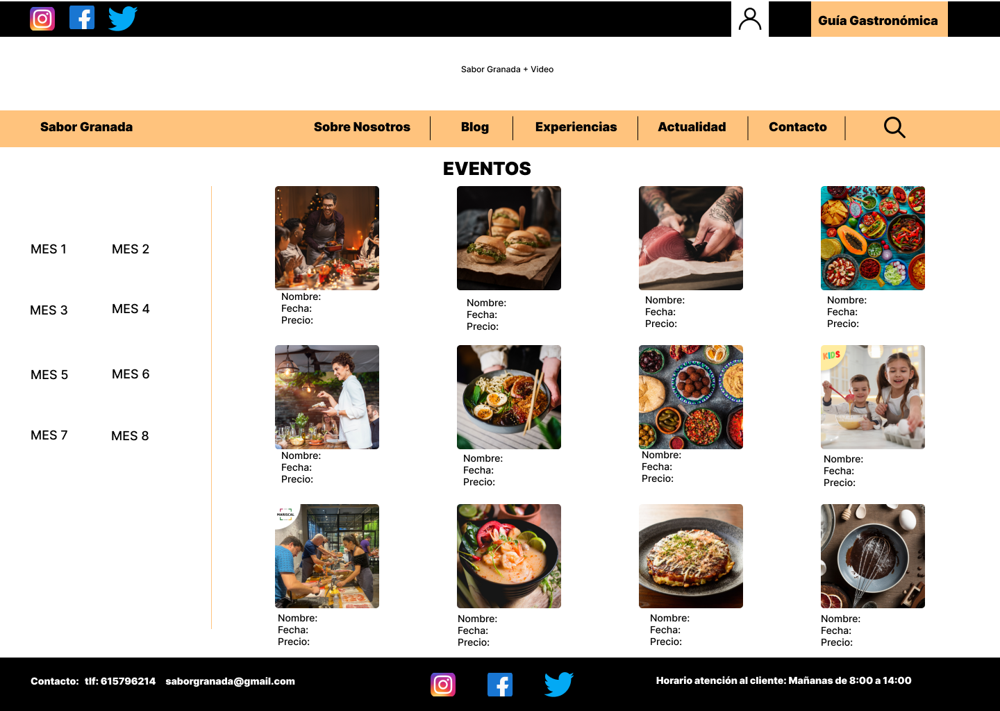
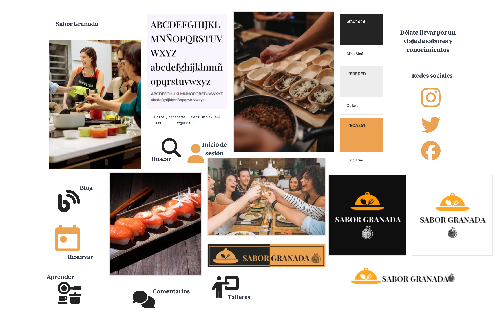

# DIU24
Prácticas Diseño Interfaces de Usuario 2023-24 (Tema: Experiencias gastronómicas ) 

Grupo: DIU2_Óscar Picado Cariño y Carmen Quiles Ramírez.  Curso: 2023/24 
Updated: 11/2/2024

Proyecto: 
SaborGranada

Descripción: 

Combinación de las diferentes webs típicas de gastronomía. Reservas de restaurantes, talleres, información de recetas, blog interactivo, gestión de puntos para el usuario...

Logotipo: 
>>> Opcionalmente si diseña un logotipo para su producto en la práctica 3 pongalo aqui

Miembros
 * :bust_in_silhouette:   Carmen Quiles Ramírez    :octocat:     
 * :bust_in_silhouette:  Óscar Picado Cariño     :octocat:

----- 

# Proceso de Diseño 

## Paso 1. UX User & Desk Research & Analisis 

 **1.a User Reseach Plan**
-----

>>> En este proyecto nos vamos a centrar en mejorar una interfaz de una página web o app que ofrece experiencias gastronómicas evaluando los principios de usabilidad y las experiencias de los usuarios.  

 1.b Competitive Analysis
-----

>>> GranadaCooking es una web que se dedica a la planificación de talleres de cocina de todo tipo y culturas, es una web un poco pobre en la que la usabilidad se hace bastante complicada, incluso llega a ser frustrante. Aún así la idea y trasfondo de la web es bueno. Esta web ofrece talleres de cocina, sin embargo, con un calendario muy desactualizado y talleres sin fechas disponibles, provocando así cierta inutilidad para este tipo de público y no ofreciendo información de rutas o restaurantes sobre la gastronomía de granada. 
>>>
>>>  PilsaEduca es una web que al igual que GranadaCooking también ofrece talleres de cocina, esta web si tiene una usabilidad bastante fácil e intuitiva. Ofrece además ventajas de registro y tarjetas regalo para individuales, parejas o grupos. Es una muy buena página web para aprender de cocina, sin embargo, no ofrece información sobre restaurantes o rutas gastronómicas, por lo que puede resultar inútil para algún tipo de público que sea esto último lo que busque. 
>>>
>>> SaborGranada en este caso está más orientada a la recomendación y búsqueda de diferentes lugares para disfrutar de experiencias gastronómicas. La usabilidad es bastante intuitiva aunque está desactualizada ya que tiene distintos enlaces que no te llevan a ninguna parte y también le faltan algunas características que podrían servir de gran utilidad a los usuarios como reseñas de los lugares ofertados. Esta web no ofrece talleres de cocina o realización de reservas en restaurantes, además no ofrece valoraciones de dichos restaurantes.
>>>
>>> Finalmente elegimos SaborGranada como página web a mejorar, consideramos que PilsaEduca está demasiado completa, aunque se podrían añadir algunas funcionalidades para otros públicos, y con GranadaCooking se podrían mejorar demasiadas cosas. Por esto hemos elegido un término medio que abarque todo tipo de público para centrarnos en la mejora de la usabilidad de la página. 

 1.c Persona
-----

>>> Hemos escogido Josefina como persona, porque pensamos que el hecho de ponernos en la piel de una persona de edad avanzada que está poco familiarizada con internet y que tiene que recurrir a páginas de internet para cubrir sus necesidades y para seguir desarrollando sus habilidades de cocina, nos va a ayudar bastante a mejorar el diseño de la página y a poder adaptarla para diferentes personas. Además los objetivos de Josefina son aprender de cocina, lo cual aporta una perspectiva diferente en comparación con centrarnos solo en rutas gastronómicas. 
>>>

>>> Por otro lado la segunda persona que hemos escogido es Pablo, una persona que está más familiarizada con las tecnologías que Josefina. Pablo busca rutas gastronómicas y conocer mejor los restaurantes y gastronomía de la ciudad. Además Pablo bsuca experiencias en pareja, lo cual nos puede aportar otro tipo de intereses. Hemos elegido a Pablo porque viene de otra ciudad y tiene una gran necesidad de páginas como estas para cumplir con sus objetivos, tener planes de pareja con su novia. 
>>>
>>> 
 1.d User Journey Map
----

>>>Josefina se ha visto en la situación de tener que enfrentarse a las nuevas tecnologías y buscar en internet nuevas recetas para aprender, se ha topado con SaborGranada (de las primeras que salen al realizar la búsqueda) y con un poco de esfuerzo ha conseguido encontrar la sección de recetas y elegir una. Por suerte, en la página de inicio habia un enlace directo a esta sección (y la mayoría de las que ofrece la web) y no ha tenido que hacer uso del menú o un buscador, secciones con las que podría no haber encontrado lo que necesitaba o perderse en ellas. Este caso no es del todo habitual que suceda de esta manera, ya que una persona de 77 normalmente no hace uso de internet, sin embargo Josefina se ha aventurado a ello y ha conseguido lo que necesitaba.

>>>Pablo ha buscado en internet lugares para obtener buenas experiencias gastronómicas en Granada. Tras buscar un poco se ha encontrado con SaborGranada. Ha entrado en la página y le ha sido bastante sencillo encontrar lo que buscaba, una sección con restaurantes en Granada, ya que en la propia página de inicio una de las opciones era restaurantes y turismo gastronómico. Aunque si es verdad que no ha tenido acceso a reseñas de otros usuarios y para realizar la reserva no ha podido ser desde el mismo sitio web, Pablo ha podido conseguir su objetivo de marena sencilla. Esta si ha sido una experiencia que puede ocurrir de manera habitual, ya que posiblemente cualquier persona que acceda a la página con el objetivo de Pablo, podrá haberlo hecho de manera sencilla y logrando el objetivo. 

 1.e Usability Review
----
>>> - Enlace al documento: 
>>> - Valoración final (numérica): 6,5
>>> - Comentario sobre la valoración: Valor acorde al análisis realizado en el Competitor Analysis. Esperábamos este resultado ya que la página cumple con las necesidades muy básicas de la mayoría de los usuarios, sin embargo hay unos cuantos aspectos a mejorar para que las experiencias de los mismos sean mejoradas. Los mejores aspectos de la página son en general la página principal, el menu, el contenido en gran parte. Los peores aspectos son la falta de un buscador, las formas de contacto y la falta de ayuda en general, tanto en la página como en los formularios. 

## Paso 2. UX Design  

 2.a Reframing / IDEACION: Feedback Capture Grid / EMpathy map 
----

 2.b ScopeCanvas
----

>>> Nuestra página web propone una versión combinada de las tradicionales webs sobre gastronomía, ofreciendo no solo información sobre restaurantes y la posibilidad de reservar mesa en ellos, sino también talleres para aprender sobre cocina. Además de ofrecer recomendaciones de restaurantes, la reserva se puede realizar de forma rápida, sencilla e intuitiva desde la propia web. Junto con estas opciones, los usuarios podrán consultar nuestro blog, donde como novedad, los usuarios registrados tendrán la posibilidad de publicar sus propias recetas. Además de estas recetas de usuarios, la web ofrecerá una sección adicional con recetas proporcionadas por profesionales. Como característica destacada, la web ofrecerá un sistema de gestión de puntos canjeables en nuestros servicios. Los puntos se obtendrán por reservas, comentarios, publicaciones e incluso por el tiempo de consulta de algunas secciones como el blog. Como novedad, también pretendemos incluir el contacto a través de redes sociales, además de los típicos métodos de contacto.

 2.b User Flow (task) analysis 
-----
* Task Analysis:
[Documento Task Analysis](P2/TaskAnalysis.pdf)
* Tareas: Iniciar sesión, buscar y reservar restaurante.

 2.c IA: Sitemap + Labelling 
----

* Sitemap

* Labelling:
[Documento Labelling](P2/Labeling.pdf)

 2.d Wireframes
-----

* Bocetos:
[Bocetos](https://github.com/carmenqr/DIU/tree/master/P2/Bocetos)

* Bocetos Lo-Fi sección Eventos:
  
[PDF de los tres](P2/Bocetos/BocetoEventos.pdf)

## Paso 3. Mi UX-Case Study (diseño)

 3.a Moodboard
-----

>>>  Para la realización de nuestro MoodBoard hemos utilizado Milanote. Hemos escogido la paleta de colores, el tipo de fuente que va a ser usado en nuestra app, tanto para cabeceras y títulos (PlayFair Display, 44), como para el cuerpo (Lato regular, 20). También se han añadido algunas imágenes a modo de idea del tipo de imágenes que aparecerán en la app. Por otro lado tenemos todos los iconos con funcionalidades básicas y cada uno con uno de los colores que aparecen en la paleta. Por último tenemos nuestros logos en distintos formatos para que se adapten a cualquier tipo de fondo y forma.
>>>
>>> Para el logo hemos utilizado Canva. En el queremos representar la dobre posibilidad de realizar reservas como de aprender de cocina, además, la granada representa un jiego de palabras entre la ciudad y la gastronomía.

  3.b Landing Page
----

>>> Este es un diseño visual para promocionar nuetsra app. En el se priorizan los colores de la empresa, el logo y las frases inspiracionales sobre los beneficios de esta propuesta. Queremos mostrar con él que es una app móvil diseñada para reservar en restaurantes y aprender de gastronomía y cocina, ya sea mediante la publicación o consulta de recetas en el blog, o mediante la inscripción en talleres. El constraste de color continuo entre el fondo, la letra y el logo buscan captar la atención del cliente, dejando en esta ocasión a un lado las típicas imágenes que acostumbran a ver en anuncios de estilo similar. 

 3.c Guidelines
----

>>> Paleta de colores:
>>> Con respecto a la paleta de colores, hemos escogido esos tonos muy similares al blanco [#EDEDED] y al negro [#242424] para que hagan buen contraste con el naranja sin necesidad de sobrecargar la app. Hemos escogido el color naranja [#ECA251] porque es conocido por su capacidad para estimular el apetito, lo cual motiva a la realización de reservas. Es un color que a menudo se asocia con frutas y verduras saludables, como naranjas, zanahorias y calabazas, lo que puede hacer que los alimentos parezcan más atractivos y apetitosos. También es un color enérgico y vibrante que se asocia con la creatividad y la diversión. Para nuestra aplicación, para el caso de los talleres o las recetas, este color puede inspirar a las personas a ser más creativas y experimentar con nuevas recetas e ingredientes. 
>>>
>>> Tipografía:
>>> PlayFair Display (cabeceras y títulos)(44)). Es una fuente serif que transmite elegancia y complejidad. Esto nos ayuda a crear una primera impresión de alta calidad para los usuarios. A pesar de la elegancia de este tipo de fuente, sigue siendo una fuente muy legible.
>>> Lato regular (cuerpo)(20)). Esta tipografía es conocida por su claridad y excelente legibilidad, sobre todo, para tamaños más pequeños. Lato proporciona al usuario una buena experiencia en la aplicación donde se pueden leer menús, descripciones y opiniones de manera clara. Un punto muy positivo de Lato es la estética neutral y la adaptabilidad a los diferentes estilos de diseño, lo que hace que el enfque del usuario se centre en el contenido.
>>> Respecto a los tamaños elegidos, hemos querido establecer una jerarquía para atraer la atención de los clientes en los títulos y secciones clave de nuestra aplicación como lo puede ser el menú. En el cuerpo nos hemos decantado por un tamaño de fuente más pequeño pero aun asi legible de manera sencilla sin tener que forzar la vista.
>>>
>>> Iconografía:
>>> Los iconos que hemos escogido para nuestra aplicación son iconos minimalistas. Estos iconos qportan tanto elegancia como sencillez, y dan un aspecto de limpieza a la página web de manera que, aunque su uso sea reiterado, la aplicación no quede cargada de estos iconos.

  3.d Mockup
----

>>> Layout: Mockup / prototipo HTML  (que permita simular tareas con estilo de IU seleccionado)

 3.e ¿My UX-Case Study?
-----

>>> Publicar my Case Study en Github..
>>> Documente y resuma el diseño de su producto

## Paso 5. Exportación & evaluación con Eye Tracking 

Exportación a HTML/Flutter
-----

)  5.b Eye Tracking method 

>>> Indica cómo diseñas experimento y reclutas usuarios (uso de gazerecorder.com)  

Diseño del experimento 
----

>> Uso de imágenes (preferentemente) -> hay que esablecer una duración de visualización y  
>> fijar las áreas de interes (AoI) antes del diseño. Planificar qué tarea debe hacer el usuario (buscar, comprar...) 

  
>> cambiar img por tu diseño de experimento  

>> Recordar que gazerecorder es una versión de pruebas: usar sólo con 3 usuarios para generar mapa de calor (recordar que crédito > 0 para que funcione) 

Resultados y valoración 
-----

>> Cambiar por tus resultados
  

## Paso 4. Evaluación 

 4.a Caso asignado
----

>>> Breve descripción del caso asignado con enlace a  su repositorio Github

 4.b User Testing
----

>>> Seleccione 4 personas ficticias. Exprese las ideas de posibles situaciones conflictivas de esa persona en las propuestas evaluadas. Asigne dos a Caso A y 2 al caso B
 

| Usuarios | Sexo/Edad     | Ocupación   |  Exp.TIC    | Personalidad | Plataforma | TestA/B
| ------------- | -------- | ----------- | ----------- | -----------  | ---------- | ----
| User1's name  | H / 18   | Estudiante  | Media       | Introvertido | Web.       | A 
| User2's name  | H / 18   | Estudiante  | Media       | Timido       | Web        | A 
| User3's name  | M / 35   | Abogado     | Baja        | Emocional    | móvil      | B 
| User4's name  | H / 18   | Estudiante  | Media       | Racional     | Web        | B 

 4.c Cuestionario SUS
----

>>> Usaremos el **Cuestionario SUS** para valorar la satisfacción de cada usuario con el diseño (A/B) realizado. Para ello usamos la [hoja de cálculo](https://github.com/mgea/DIU19/blob/master/Cuestionario%20SUS%20DIU.xlsx) para calcular resultados sigiendo las pautas para usar la escala SUS e interpretar los resultados
http://usabilitygeek.com/how-to-use-the-system-usability-scale-sus-to-evaluate-the-usability-of-your-website/)
Para más información, consultar aquí sobre la [metodología SUS](https://cui.unige.ch/isi/icle-wiki/_media/ipm:test-suschapt.pdf)

>>> Adjuntar captura de imagen con los resultados + Valoración personal 

 4.d Usability Report
----

>> Añadir report de usabilidad para práctica B (la de los compañeros)

>>> Valoración personal 

5.) Conclusion de EVALUACION (A/B testing + usability report + eye tracking) 
----

>> recupera el usability report de tu práctica (que es el caso B de los asignados a otros grupos) 
>> con los resultados del A/B testing, de eye tracking y del usability report:
>>  comentad en 2-3 parrafos cual es la conclusion acerca de la realización de la práctica y su evaluación con esas técnicas y que habéis aprendido

## Conclusión final / Valoración de las prácticas

>>> (90-150 palabras) Opinión FINAL del proceso de desarrollo de diseño siguiendo metodología UX y valoración (positiva /negativa) de los resultados obtenidos  

