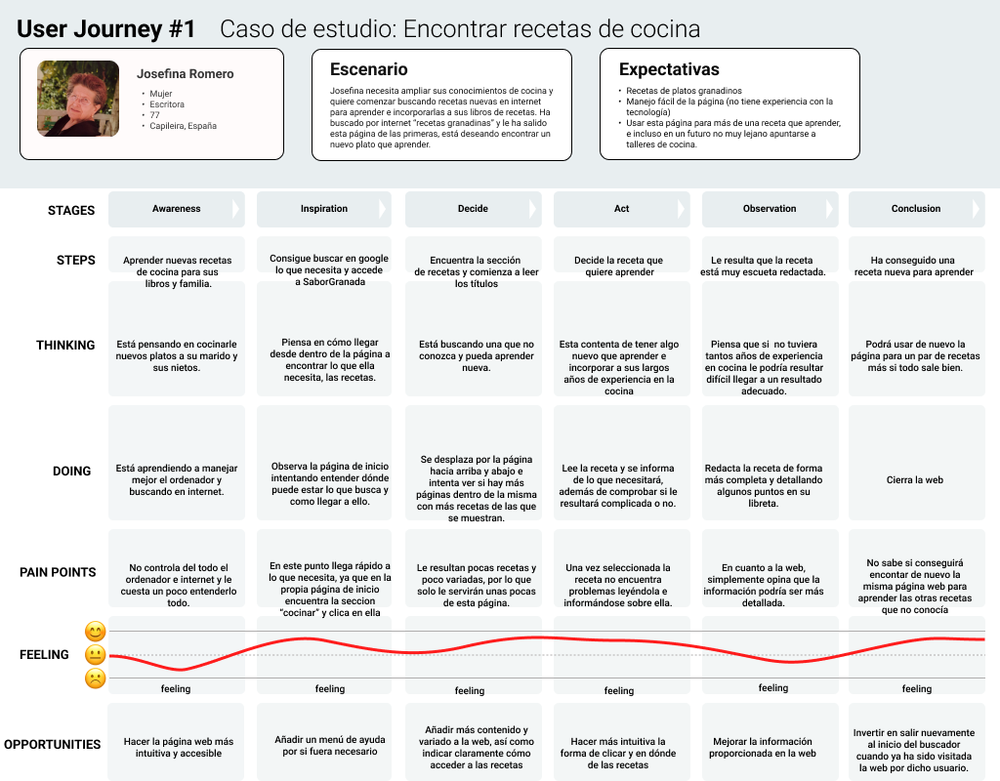
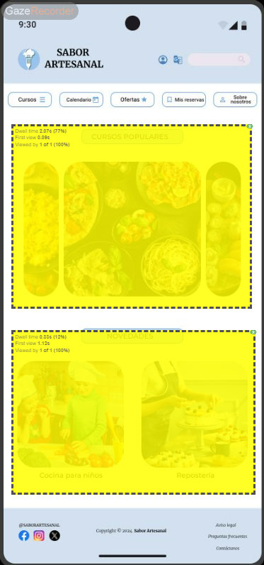

# DIU24
Prácticas Diseño Interfaces de Usuario 2023-24 (Tema: Experiencias gastronómicas ) 

Grupo: DIU2_Óscar Picado Cariño y Carmen Quiles Ramírez.  Curso: 2023/24 
Updated: 11/2/2024

Proyecto: 
SaborGranada

Descripción: 

Nuestra página web propone una versión combinada de las tradicionales webs sobre gastronomía, ofreciendo no solo información sobre restaurantes y la posibilidad de reservar mesa en ellos, sino también talleres para aprender sobre cocina. Además de ofrecer recomendaciones de restaurantes, la reserva se puede realizar de forma rápida, sencilla e intuitiva desde la propia web. Junto con estas opciones, los usuarios pueden consultar nuestro blog, donde los usuarios registrados tienen la posibilidad de publicar sus propias recetas. Además de estas recetas de usuarios, la web proporciona una sección adicional con recetas creadas por profesionales. Como característica destacada, la web ofrece un sistema de gestión de puntos canjeables en nuestros servicios. Los puntos se obtendrán por reservas, comentarios, publicaciones e incluso por el tiempo de consulta de algunas secciones como el blog.

Logotipo: 

Miembros
 * :bust_in_silhouette:   Carmen Quiles Ramírez    :octocat:     
 * :bust_in_silhouette:  Óscar Picado Cariño     :octocat:

----- 

# Proceso de Diseño 

## Paso 1. UX User & Desk Research & Analisis 

 **1.a User Reseach Plan**
-----

>>> En este proyecto nos vamos a centrar en mejorar una interfaz de una página web o app que ofrece experiencias gastronómicas evaluando los principios de usabilidad y las experiencias de los usuarios.  

 1.b Competitive Analysis
-----

>>> GranadaCooking es una web que se dedica a la planificación de talleres de cocina de todo tipo y culturas, es una web un poco pobre en la que la usabilidad se hace bastante complicada, incluso llega a ser frustrante. Aún así la idea y trasfondo de la web es bueno. Esta web ofrece talleres de cocina, sin embargo, con un calendario muy desactualizado y talleres sin fechas disponibles, provocando así cierta inutilidad para este tipo de público y no ofreciendo información de rutas o restaurantes sobre la gastronomía de granada. 
>>>
>>>  PilsaEduca es una web que al igual que GranadaCooking también ofrece talleres de cocina, esta web si tiene una usabilidad bastante fácil e intuitiva. Ofrece además ventajas de registro y tarjetas regalo para individuales, parejas o grupos. Es una muy buena página web para aprender de cocina, sin embargo, no ofrece información sobre restaurantes o rutas gastronómicas, por lo que puede resultar inútil para algún tipo de público que sea esto último lo que busque. 
>>>
>>> SaborGranada en este caso está más orientada a la recomendación y búsqueda de diferentes lugares para disfrutar de experiencias gastronómicas. La usabilidad es bastante intuitiva aunque está desactualizada ya que tiene distintos enlaces que no te llevan a ninguna parte y también le faltan algunas características que podrían servir de gran utilidad a los usuarios como reseñas de los lugares ofertados. Esta web no ofrece talleres de cocina o realización de reservas en restaurantes, además no ofrece valoraciones de dichos restaurantes.
>>>
>>> Finalmente elegimos SaborGranada como página web a mejorar, consideramos que PilsaEduca está demasiado completa, aunque se podrían añadir algunas funcionalidades para otros públicos, y con GranadaCooking se podrían mejorar demasiadas cosas. Por esto hemos elegido un término medio que abarque todo tipo de público para centrarnos en la mejora de la usabilidad de la página. 

 1.c Persona
-----

>>> Hemos escogido Josefina como persona, porque pensamos que el hecho de ponernos en la piel de una persona de edad avanzada que está poco familiarizada con internet y que tiene que recurrir a páginas de internet para cubrir sus necesidades y para seguir desarrollando sus habilidades de cocina, nos va a ayudar bastante a mejorar el diseño de la página y a poder adaptarla para diferentes personas. Además los objetivos de Josefina son aprender de cocina, lo cual aporta una perspectiva diferente en comparación con centrarnos solo en rutas gastronómicas. 
>>>

>>> Por otro lado la segunda persona que hemos escogido es Pablo, una persona que está más familiarizada con las tecnologías que Josefina. Pablo busca rutas gastronómicas y conocer mejor los restaurantes y gastronomía de la ciudad. Además Pablo bsuca experiencias en pareja, lo cual nos puede aportar otro tipo de intereses. Hemos elegido a Pablo porque viene de otra ciudad y tiene una gran necesidad de páginas como estas para cumplir con sus objetivos, tener planes de pareja con su novia. 
>>>
>>> 
 1.d User Journey Map
----

>>>Josefina se ha visto en la situación de tener que enfrentarse a las nuevas tecnologías y buscar en internet nuevas recetas para aprender, se ha topado con SaborGranada (de las primeras que salen al realizar la búsqueda) y con un poco de esfuerzo ha conseguido encontrar la sección de recetas y elegir una. Por suerte, en la página de inicio habia un enlace directo a esta sección (y la mayoría de las que ofrece la web) y no ha tenido que hacer uso del menú o un buscador, secciones con las que podría no haber encontrado lo que necesitaba o perderse en ellas. Este caso no es del todo habitual que suceda de esta manera, ya que una persona de 77 normalmente no hace uso de internet, sin embargo Josefina se ha aventurado a ello y ha conseguido lo que necesitaba.

>>>Pablo ha buscado en internet lugares para obtener buenas experiencias gastronómicas en Granada. Tras buscar un poco se ha encontrado con SaborGranada. Ha entrado en la página y le ha sido bastante sencillo encontrar lo que buscaba, una sección con restaurantes en Granada, ya que en la propia página de inicio una de las opciones era restaurantes y turismo gastronómico. Aunque si es verdad que no ha tenido acceso a reseñas de otros usuarios y para realizar la reserva no ha podido ser desde el mismo sitio web, Pablo ha podido conseguir su objetivo de marena sencilla. Esta si ha sido una experiencia que puede ocurrir de manera habitual, ya que posiblemente cualquier persona que acceda a la página con el objetivo de Pablo, podrá haberlo hecho de manera sencilla y logrando el objetivo. 

 1.e Usability Review
----
>>> - Enlace al documento: 
>>> - Valoración final (numérica): 6,5
>>> - Comentario sobre la valoración: Valor acorde al análisis realizado en el Competitor Analysis. Esperábamos este resultado ya que la página cumple con las necesidades muy básicas de la mayoría de los usuarios, sin embargo hay unos cuantos aspectos a mejorar para que las experiencias de los mismos sean mejoradas. Los mejores aspectos de la página son en general la página principal, el menu, el contenido en gran parte. Los peores aspectos son la falta de un buscador, las formas de contacto y la falta de ayuda en general, tanto en la página como en los formularios. 

## Paso 2. UX Design  

 2.a Reframing / IDEACION: Feedback Capture Grid / EMpathy map 
----

 2.b ScopeCanvas
----

>>> Nuestra página web propone una versión combinada de las tradicionales webs sobre gastronomía, ofreciendo no solo información sobre restaurantes y la posibilidad de reservar mesa en ellos, sino también talleres para aprender sobre cocina. Además de ofrecer recomendaciones de restaurantes, la reserva se puede realizar de forma rápida, sencilla e intuitiva desde la propia web. Junto con estas opciones, los usuarios podrán consultar nuestro blog, donde como novedad, los usuarios registrados tendrán la posibilidad de publicar sus propias recetas. Además de estas recetas de usuarios, la web ofrecerá una sección adicional con recetas proporcionadas por profesionales. Como característica destacada, la web ofrecerá un sistema de gestión de puntos canjeables en nuestros servicios. Los puntos se obtendrán por reservas, comentarios, publicaciones e incluso por el tiempo de consulta de algunas secciones como el blog. Como novedad, también pretendemos incluir el contacto a través de redes sociales, además de los típicos métodos de contacto.

 2.b User Flow (task) analysis 
-----
* Task Analysis:
[Documento Task Analysis](P2/TaskAnalysis.pdf)
* Táreas: Iniciar sesión, buscar y reservar restaurante.

 2.c IA: Sitemap + Labelling 
----

* Sitemap

* Labelling:
[Documento Labelling](P2/Labeling.pdf)

 2.d Wireframes
-----

* Bocetos:
[Bocetos](https://github.com/carmenqr/DIU/tree/master/P2/Bocetos)

* Bocetos Lo-Fi sección Eventos:
  
[PDF de los tres](P2/Bocetos/BocetoEventos.pdf)

  
  
  

## Paso 3. Mi UX-Case Study (diseño)

 3.a Moodboard
-----

>>>  Para la realización de nuestro MoodBoard hemos utilizado Milanote. Hemos escogido la paleta de colores, el tipo de fuente que va a ser usado en nuestra app, tanto para cabeceras y títulos (PlayFair Display, 44), como para el cuerpo (Lato regular, 20). También se han añadido algunas imágenes a modo de idea del tipo de imágenes que aparecerán en la app. Por otro lado tenemos todos los iconos con funcionalidades básicas y cada uno con uno de los colores que aparecen en la paleta. Por último tenemos nuestros logos en distintos formatos para que se adapten a cualquier tipo de fondo y forma.
>>>
>>> Para el logo hemos utilizado Canva. En el queremos representar la dobre posibilidad de realizar reservas como de aprender de cocina, además, la granada representa un jiego de palabras entre la ciudad y la gastronomía.

  3.b Landing Page
----

>>> Este es un diseño visual para promocionar nuetsra app. En el se priorizan los colores de la empresa, el logo y las frases inspiracionales sobre los beneficios de esta propuesta. Queremos mostrar con él que es una app móvil diseñada para reservar en restaurantes y aprender de gastronomía y cocina, ya sea mediante la publicación o consulta de recetas en el blog, o mediante la inscripción en talleres. El constraste de color continuo entre el fondo, la letra y el logo buscan captar la atención del cliente, dejando en esta ocasión a un lado las típicas imágenes que acostumbran a ver en anuncios de estilo similar. 

 3.c Guidelines
----

>>> Paleta de colores:
>>> Con respecto a la paleta de colores, hemos escogido esos tonos muy similares al blanco [#EDEDED] y al negro [#242424] para que hagan buen contraste con el naranja sin necesidad de sobrecargar la app. Hemos escogido el color naranja [#ECA251] porque es conocido por su capacidad para estimular el apetito, lo cual motiva a la realización de reservas. Es un color que a menudo se asocia con frutas y verduras saludables, como naranjas, zanahorias y calabazas, lo que puede hacer que los alimentos parezcan más atractivos y apetitosos. También es un color enérgico y vibrante que se asocia con la creatividad y la diversión. Para nuestra aplicación, para el caso de los talleres o las recetas, este color puede inspirar a las personas a ser más creativas y experimentar con nuevas recetas e ingredientes. 
>>>
>>> Tipografía:
>>> PlayFair Display (cabeceras y títulos)(44)). Es una fuente serif que transmite elegancia y complejidad. Esto nos ayuda a crear una primera impresión de alta calidad para los usuarios. A pesar de la elegancia de este tipo de fuente, sigue siendo una fuente muy legible.
>>> Lato regular (cuerpo)(20)). Esta tipografía es conocida por su claridad y excelente legibilidad, sobre todo, para tamaños más pequeños. Lato proporciona al usuario una buena experiencia en la aplicación donde se pueden leer menús, descripciones y opiniones de manera clara. Un punto muy positivo de Lato es la estética neutral y la adaptabilidad a los diferentes estilos de diseño, lo que hace que el enfque del usuario se centre en el contenido.
>>> Respecto a los tamaños elegidos, hemos querido establecer una jerarquía para atraer la atención de los clientes en los títulos y secciones clave de nuestra aplicación como lo puede ser el menú. En el cuerpo nos hemos decantado por un tamaño de fuente más pequeño pero aun asi legible de manera sencilla sin tener que forzar la vista.
>>>
>>> Iconografía:
>>> Los iconos que hemos escogido para nuestra aplicación son iconos minimalistas. Estos iconos qportan tanto elegancia como sencillez, y dan un aspecto de limpieza a la página web de manera que, aunque su uso sea reiterado, la aplicación no quede cargada de estos iconos.
>>>
>>> Layouts HI-FI:
>>> Usaremos figma con el plugin Material 3: Design Kit, del mismo usaremos los siguientes componentes:
>>> Hero image + Carousel, Search, Article List, List Item, Icons, Buttons, Cards, Checkboxes, Date pickers, Dialog, Dividers, Floatting Button, Menus, Navigation bar y Sliders.
>>>
>>> Carousel: Los hemos usado para añadir imágenes que el usuario pueda desplazarse horizontalmente de unas a otras. Implementamos el carrusel tanto en la página de inicio, para que el usuario pueda elegir a qué apartado de la app dirigirse, como dentro de las reservas de cada restaurante para que pueda ver fotografías de este. Los carruseles dentro de nuestra página son de gran tamaño ya que consideramos las imágenes importantes y orientativas para la toma de decisiones del usuario en la aplicación.

>>> List: Las listas permiten al usuario elegir en algunos apartados la opción deseada. Por ejemplo, en la realización de la reserva, el usuario debe poder elegir para cuántas personas se va a realizar dicha reserva. En el perfil, los datos del usuario se visualizan en una lista también. El tamaño de estas se adapta según la cantidad de ítems, pero nunca llegando a ser demasiado grande.
>>>
>>> Checkboxes: Estas cajas están presentes dentro de algunas listas donde se debe seleccionar una opción. Por ejemplo, en la lista de la selección del horario de la reserva, se marca cuál está seleccionada en ese momento. Son elementos pequeños pero muy visibles para que sea sencillo marcarlos.
>>>
>>>Date pickers: El date picker se implementa para la selección de la fecha de la reserva del restaurante. Ocupa prácticamente toda la pantalla, debido a que es un elemento muy importante a la hora de realizar una reserva.
>>>
>>> Floating button: Este botón permite al usuario iniciar una acción. En nuestra app, el botón de reservar lleva al inicio del proceso de reserva. Estos botones son suficientemente visibles para los usuarios y llamativos, de forma que el usuario no tenga problemas en verlos para realizar la acción.
>>>
>>> Menús: El componente menú sirve para el menú de nuestra app, que es un menú desplegable a través de una flecha que hay siempre al lado del nombre o del logo de SaborGranada. El menú desplegable, una vez visible, tiene un tamaño adecuado para poder leerlo de manera clara.
>>>
>>> Divider: Los divisores se utilizan únicamente por cuestión de diseño y legibilidad en algunas listas y menús de nuestra aplicación, para separar de forma visual los distintos ítems de una lista o un menú. También están presentes en la división de la página con el "pie de página".
>>>
>>> Cards: Este componente se usa para el resumen de la realización de la reserva, ocupando una gran parte de la pantalla para que la información principal destaque y no haya otros componentes que puedan distraer al usuario.
>>> 
>>>Items: Los ítems juegan un papel importante en la interacción del usuario con la página, ya que muchos de ellos se utilizan como botones. La flecha continúa hacia adelante dentro del proceso de reserva. Luego, al lado del nombre, hay una flecha que despliega el menú. Ítems como la lupa (búsqueda), el calendario (reservas) y el símbolo de usuario (inicio de sesión/ver perfil) aparecen como un menú en la parte inferior de nuestro móvil, sin importar la página en la que te encuentres, ya que son funcionalidades muy útiles dentro de la app. Estos íconos tienen un tamaño adecuado para que no molesten en las demás páginas, pero se puedan ver de manera clara.

  3.d Mockup
----
[Enlace a figma](https://www.figma.com/design/uwFSMnlWorFbFk6j1MGKhk/Gideline-o-layout?node-id=54819%3A26957&t=dwR3rdxcHT28azl1-1)

  
  
  
  
  
  
  
  

[Ver vídeo animación](P3/LayoutHIFI.mp4)

>>> Este mockup representa la realización de la tárea _reservar_ en nuestra app. Partimos de la página del restaurante en la que encontramos además de la información general y una valoración por parte de los usuarios, el botón de _realizar reserva_. Automáticamente se redirige al calendario para seleccionar la fecha, a continuación a la hora y por último al número de personas que acudirán a la misma. Finalmente se muestra un resumen de la reserva, en el que se pueden editar los campos seleccionados previamente (el nombre y correo se rellenan por defecto con los datos del usuario que reserva, por tanto ha de estar registrado). Al acabar la reserva se muestra un mensaje final de confirmación.

 3.e ¿My UX-Case Study?
-----

**Introducción**

En el competitivo mundo digital actual, ofrecer una experiencia única y completa al usuario es clave para destacar. Con SaborGranada, hemos creado una plataforma integral dedicada a las experiencias gastronómicas en Granada, fusionando lo mejor de las recomendaciones de restaurantes, la reserva de mesas y la enseñanza culinaria. Aquí, te contamos cómo hemos llegado a desarrollar este producto excepcional, diseñado para satisfacer las necesidades tanto de los amantes de la gastronomía como de aquellos que desean aprender y explorar nuevas recetas.

**Identificación de la Necesidad**

Nuestro viaje comenzó con una investigación exhaustiva del mercado y del usuario. Observamos que muchas páginas web dedicadas a la gastronomía se centraban únicamente en uno o dos aspectos, ya sea en la reserva de restaurantes o en la oferta de talleres de cocina, pero no en ambos. Identificamos una oportunidad para crear una solución que integrara estos servicios, brindando a los usuarios una experiencia más completa y enriquecedora.

**Investigación y Análisis**

Realizamos un análisis comparativo de las principales webs de gastronomía y descubrimos que, aunque algunas tenían un diseño intuitivo y buenas funcionalidades, carecían de la integración necesaria para ofrecer una experiencia global. Nos centramos en entender las frustraciones y necesidades de los usuarios a través de metodologías de investigación de usuarios, como el análisis competitivo y la creación de perfiles de usuarios (personas).

**Diseño Centrado en el Usuario**

Elegimos como referencia a dos usuarios tipo: Josefina, una persona mayor interesada en aprender nuevas recetas, y Pablo, un joven que busca experiencias gastronómicas para disfrutar en pareja. Estos perfiles nos permitieron diseñar una interfaz accesible y funcional para diferentes tipos de usuarios. La inclusión de un sistema de puntos canjeables y un blog interactivo donde los usuarios pueden publicar sus propias recetas añadió un valor significativo a nuestra plataforma.

**Proceso de Diseño**

El diseño de SaborGranada se basó en principios de usabilidad y accesibilidad, asegurándonos de que la navegación fuera intuitiva y que los usuarios pudieran realizar sus táreas de manera eficiente. A través de wireframes, mapas del sitio y bocetos, fuimos refinando nuestra visión hasta llegar a un producto que no solo fuera funcional, sino también atractivo visualmente.

**Implementación y Resultados**

El resultado final es una página web (o una app) que combina lo mejor de ambos mundos: la facilidad de encontrar y reservar en los mejores restaurantes de Granada y la oportunidad de aprender y compartir conocimientos culinarios. La gestión de puntos canjeables y la integración con redes sociales facilitan la interacción continua de los usuarios con la plataforma, fomentando una comunidad activa y comprometida.

**Conclusión**

SaborGranada no es solo una página web o app, es una experiencia gastronómica integral diseñada para satisfacer las necesidades de diversos usuarios. Desde la fácil navegación para personas mayores hasta las funciones avanzadas para los más jóvenes, nuestro producto ofrece una solución completa que destaca en el mercado. Con una interfaz intuitiva, contenido rico y características innovadoras, SaborGranada se posiciona como una herramienta esencial para cualquier amante de la gastronomía.

En resumen, SaborGranada es el resultado de un proceso de diseño meticuloso y centrado en el usuario, que integra múltiples servicios en una plataforma cohesiva y atractiva. Estamos orgullosos de presentar un producto que no solo cumple, sino que supera las expectativas de nuestros usuarios, haciendo de cada visita una experiencia memorable.

## Paso 5. Exportación & evaluación con Eye Tracking 

Exportación a HTML/Flutter
-----

)  5.b Eye Tracking method 

>>> Indica cómo diseñas experimento y reclutas usuarios (uso de gazerecorder.com)  

Diseño del experimento 
----

>> Para el estudio mediante EyeTracking hemos utilizado gazerecorder.com, donde se nos permite usar tecnologías para marcar áreas de interés y luego hacer un seguimiento de la vista generando así un mapa de calor para mostrar si los usuarios realmente fijan su mirada en los sitios realmente importantes de la aplicación.
>> 
>> Este estudio, lo hemos realizado tanto para nuestra aplicación (SaborGranada) como para la aplicación que se nos asignó de los compañeros (sabor Artesanal).
>> 
>> En primer lugar vamos a mostrar los resultados obtenidos para nuestra app. El estudio está centrado en la tárea de reservar.
>> En las siguientes imágenes se pueden ver las áreas donde se ha centrado el usuario al hacer una reserva.

  
  
  
  
  
  
  
  

>>Y a continuación en el recuadro amarillo podemos ver las áreas de interés:

  
  
  
  
  
  
  
  

>> Como se puede observar en las imágenes y nos muestran los datos que hay en las imágenes donde se encuentran marcadas las áreas de interés, el usuario ha pasado gran parte del tiempo mirando en estas zonas lo que nos lleva a concluir que el diseño de la interfaz de nuestra applicación para realizar reservas es un diseño sencillo y bastante intuitivo.
>>
>> A continuación realizamos el mismo experimento para la aplicación Sabor Artesanal obteniendo los siguientes mapas de calor:
>>

  
  
  
  
  
  
  
  
  
  
  
  

>>  Y marcando como áreas de interés las siguientes:

  
  
  
  
  
  
  
  
  
  
  
  

Resultados y valoración 
>>Después de realizar el seguimiento ocular (EyeTracking), hemos observado que las zonas de calor están principalmente concentradas en los puntos críticos donde la aplicación necesita captar la atención del usuario, como los botones de acción y la información relevante. Esta distribución sugiere que el diseño de la interfaz de usuario está efectivamente guiando la atención del usuario hacia las áreas clave de interacción y contenido.

>>En general, el análisis de EyeTracking para ambas aplicaciones arroja resultados positivos. Las áreas de mayor interés visual coinciden con los elementos importantes que los usuarios deben percibir y con los que interactuar para utilizar la aplicación de manera efectiva. Este hallazgo respalda la eficacia del diseño en términos de usabilidad y experiencia del usuario, ya que las áreas de enfoque visual se alinean con los objetivos de diseño de la aplicación.

>>Estos resultados refuerzan la impresión general de que la aplicación tiene un enfoque efectivo en la presentación de información y elementos de interacción, lo que facilita la navegación y el uso para los usuarios. Sin embargo, siempre hay margen para la mejora continua y la optimización del diseño con base en los hallazgos obtenidos en este estudio de EyeTracking.

## Paso 4. Evaluación 

 4.a Caso asignado
----

>>> Sabor Artesanal es una página web que ofrece talleres de cocina de todo tipo. Cuenta con calendario y un sistema de gestión de reservas, así como la consulta de las mismas desde tu perfil.
>>> DIU2_kebabmixto https://github.com/heleniya/DIU.kebabmixto

 4.b User Testing
----

>>> 
 

| Usuario  | Sexo/edad | Ocupación  | Experiencia internet | Plataforma | Perfil cubierto | Test | SUS score |
|----------|-----------|------------|----------------------|------------|-----------------|------|-----------|
| Lucía    | M/15      | Estudiante | Alta                 | IOS        | Enfadada        | A    | 90        |
| Pepe     | H/64      | Jubilado   | Baja                 | Windows    | Sorprendido     | A    | 67,5      |
| Rosa     | M/33      | Profesora  | Alta                 | Android    | Disgustada      | B    | 85        |
| Fernando | H/59      | Peluquero  | Intermedia           | Windows    | Feliz           | B    | 65        |

 4.c Cuestionario SUS
----

>>> Usaremos el **Cuestionario SUS** para valorar la satisfacción de cada usuario con el diseño (A/B) realizado. Para ello usamos la [hoja de cálculo](https://github.com/mgea/DIU19/blob/master/Cuestionario%20SUS%20DIU.xlsx) para calcular resultados sigiendo las pautas para usar la escala SUS e interpretar los resultados
http://usabilitygeek.com/how-to-use-the-system-usability-scale-sus-to-evaluate-the-usability-of-your-website/)
Para más información, consultar aquí sobre la [metodología SUS](https://cui.unige.ch/isi/icle-wiki/_media/ipm:test-suschapt.pdf)

>>> Adjuntar captura de imagen con los resultados + Valoración personal 

 4.d Usability Report
----

>> Añadir report de usabilidad para práctica B (la de los compañeros)

>>> Valoración personal 

5.) Conclusion de EVALUACION (A/B testing + usability report + eye tracking) 
----

>> recupera el usability report de tu práctica (que es el caso B de los asignados a otros grupos) 
>> con los resultados del A/B testing, de eye tracking y del usability report:
>>  comentad en 2-3 parrafos cual es la conclusion acerca de la realización de la práctica y su evaluación con esas técnicas y que habéis aprendido

## Conclusión final / Valoración de las prácticas

>>> (90-150 palabras) Opinión FINAL del proceso de desarrollo de diseño siguiendo metodología UX y valoración (positiva /negativa) de los resultados obtenidos  

